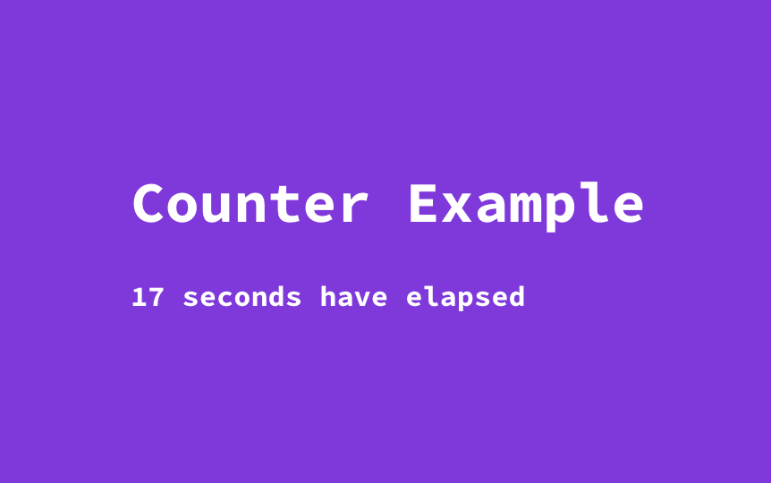

# Hero
Proof of Concept Cross-framework UI Component Framework in TypeScript

## Supported Features
- [x] SCSS as default style preprocessor
- [x] Reference SCSS & HTML files in `@Component` decorator
- [x] One-way Data Binding for template
- [x] Hot Page Reloading
- [ ] Data Binding for attributes
- [ ] Input & Output

## Get Started
### Examples
#### Counter


##### counter.component.ts

```typescript
import {Component} from '@hero';

@Component({
    selector: 'ui-counter',
    templateUrl: './counter.component.html',
    styleUrls: ['./counter.component.scss']
})
export class CounterComponent {
    seconds: number;

    constructor() {
        this.seconds = 0;

        setInterval(()=>{
            this.seconds++;
        }, 1000);
    }
}

```

##### counter.component.html

```html
<div>{{seconds}} seconds have elapsed</div>
```

##### counter.component.scss

```scss
ui-counter {
  width: 400px;
  color: white;
  display: block;
  font-weight: bold;
  margin-top: 20px;
}

```

### Prerequisites
- Node.js v8.9.4
- yarn v1.12.3

### Installing Dependencies
```
yarn
```

## Development

### Compiling project

```
yarn watch
```

You should see the following files in `dist`:

- index.html
- ui.js

To view the example app, open `index.html` in the web browswer.

The page will automatically reload on code change through the magic provided by `HotReload` Webpack plugin.

### Using components in exisiting app
You only need to include the generated `ui.js` file in the HTML to integrate `hero` UI components in your existing project.

## Testing

```
yarn test
```

## Authors
- Harry Liu ( **byliuyang11@gmail.com** )
